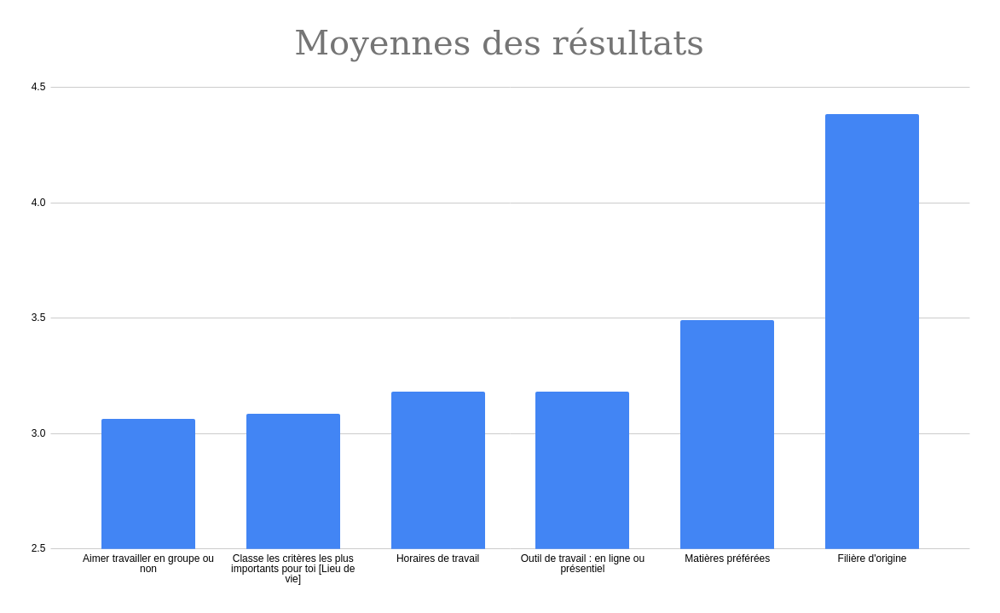

--- 
title: "Application binomes de travail"
subtitle: "Résultats sondage"
output: pdf_document 
header-includes:
   - \usepackage{amsmath}
   - \graphicspath{ {.} }
---
\setlength{\abovedisplayskip}{-5pt}
\setlength{\belowdisplayskip}{10pt}
\setlength{\abovedisplayshortskip}{0pt}
\setlength{\belowdisplayshortskip}{0pt}

Sondage des élèves
------------------

Les élèves ont été sondés afin de savoir quels critères étaient les plus important pour eux.

Il ont pu choisir parmis:

* Une échelle d’importance de 1 (très important) à 5 (peu important) 
* Inutile (associé à un score de 10)

Les critères étaient les suivants:

* Matières préférées
* Horaires de travail
* Outil de travail : en ligne ou présentiel
* Lieu de vie
* Aimer travailler en groupe ou non
* Filière d'origine

On s’intéresse alors à la moyenne des résultats. Plus le résultat est proche de 1, plus la catégorie est importante pour les étudiants.

Résultats du sondage “raw” : [Résultats Gsheet](https://docs.google.com/forms/d/1aWPi4nKY_tGc7IawBvqqoYyCzAbqIDzCa3jdBokr6cA/edit#responses) \newline
Résultats du sondage “traité”: [Résultats Gsheet Traité](https://docs.google.com/spreadsheets/d/1HpurMUUlV_KsP561ObW4qF1djskfsxWDlW2lZH0AjeM/edit#gid=2140292120)

On discerne donc 4 critères qui semblent particulièrement important pour les étudiants:

* Horaires de travail
* Outil de travail : en ligne ou présentiel
* Lieu de vie
* Aimer travailler en groupe ou non

Les matières préférées ne semblent pas être une priorité absolue pour les étudiants mais certains d'entre eux ont mentionnés
le fait qu'il serait intéressant d'être mis avec des personnes n'ayant pas forcément les même matières favorites
afin de se complêter.
Cependant ce critère n'a pas été évalué et repose donc sur notre jugement.

\pagebreak
