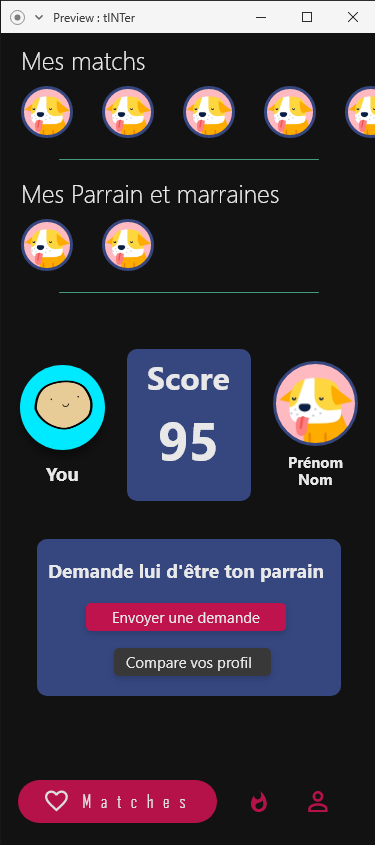
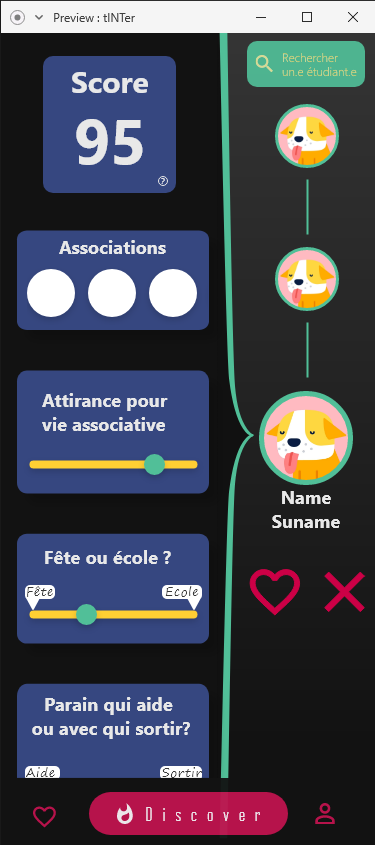

--- 
title: "tINTer"
subtitle: "Design Evolution"
output: pdf_document 
header-includes:
   - \usepackage{amsmath}
   - \graphicspath{ {.} }
---

Une refonte graphique a été faite pour plusieurs raisons:

1. Une plus grande accessibilité, permattant l'implementation de nouvelles fonctionnalités
1. Un theme noir.
1. Un rafraichissement général pour une esthetique plus agréable.

|       | Matchs sauvegardés | Discover new matches | Profile |
|:-----:|:-------------------:|:--------------------:|:-------:|
| Avant ||||
|:-----:|:-------------------:|:--------------------:|:-------:|
| Après ||||