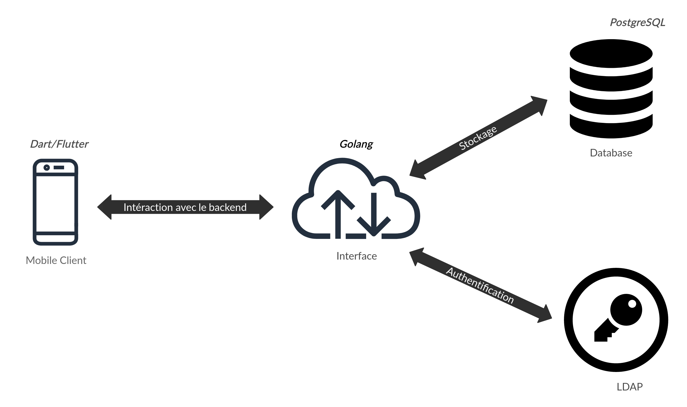

tINTer

Une application de parrainage pour Telecom SudParis.

&nbsp;

&nbsp;
&nbsp;

# Projet
Le but de ce projet est de créer une application pour renforcer le système de parrainage.

# Schéma fonctionnel

# Cahier des charges
Voir [PDF: Cahier des charges](Documentation/Cahier_des_charges.pdf)